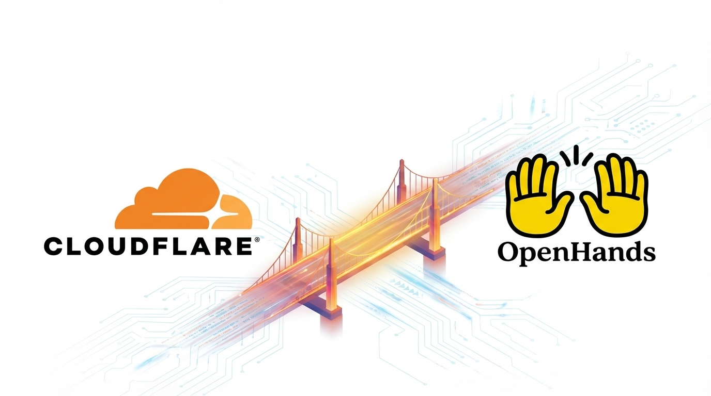

# Cloudflare OpenHands SDK

SDK for integrating OpenHands agent-server with Cloudflare Workers Sandbox.



## Installation

```bash
npm install cloudflare-openhands-sdk
# or
pnpm add cloudflare-openhands-sdk
# or
bun add cloudflare-openhands-sdk
```

## Prerequisites

- `@cloudflare/sandbox` (peer dependency) - Install in your Worker project
- Cloudflare Workers Paid account
- Custom domain (required for preview URLs)

## Quick Start

The fastest way to get started is using our example template:

```bash
npm create cloudflare@latest -- openhands-example --template=jagzmz/cloudflare-openhands-sdk/examples/openhands
# or
pnpm create cloudflare@latest -- openhands-example --template=jagzmz/cloudflare-openhands-sdk/examples/openhands
```

For detailed setup instructions, deployment guide, and usage examples, see the [example README](examples/openhands/README.md).

## Using the SDK in Your Worker

```typescript
import { attachOpenhandsRoutes } from 'cloudflare-openhands-sdk/routes';

export default attachOpenhandsRoutes(async (request, env) => {
  // Your custom routes here
  return new Response('Not found', { status: 404 });
}, {
  port: 8001,
  exposePort: true,
  hostname: 'yourdomain.com'
});
```

## API Reference

### `createOpenhandsServer(sandbox, options?)`

Creates and manages an OpenHands agent-server instance.

```typescript
import { getSandbox } from '@cloudflare/sandbox';
import { createOpenhandsServer } from 'cloudflare-openhands-sdk/openhands';

const sandbox = getSandbox(env.Sandbox, 'my-sandbox');
const server = await createOpenhandsServer(sandbox, {
  port: 8001,
  exposePort: true,
  hostname: 'yourdomain.com'
});
```

### `proxyToOpenhands(request, sandbox, server)`

Proxies requests to the agent-server.

```typescript
import { proxyToOpenhands } from 'cloudflare-openhands-sdk/openhands';

return proxyToOpenhands(request, sandbox, server);
```

### `attachOpenhandsRoutes(fetchHandler, options?)`

Attaches OpenHands routes to your Worker handler.

**Routes:**
- `GET /start-openhands` - Start the agent-server
- `GET /stop-openhands` - Stop the agent-server
- `GET /openhands-status` - Get server status

## Dockerfile

The package includes a pre-configured Dockerfile that:
- Installs build tools (make, build-essential)
- Installs `uv` package manager
- Clones and builds the OpenHands software-agent-sdk
- Sets up the agent-server environment

For a complete Wrangler configuration example, see the [example project](examples/openhands/).

## Configuration Options

```typescript
interface OpenhandsOptions {
  port?: number;                    // Default: 8001
  directory?: string;               // Default: /container-server/software-agent-sdk
  hostname?: string;                // Required if exposePort is true
  exposePort?: boolean;             // Default: false
  env?: Record<string, string>;     // Environment variables for agent-server
  sandboxName?: string;             // Default: 'my-sandbox'
}
```

## License

Apache 2.0

This project is licensed under the Apache License, Version 2.0. See the [LICENSE](LICENSE) file for details.

## Acknowledgments

This project was inspired by the [Cloudflare Sandbox SDK opencode example](https://github.com/cloudflare/sandbox-sdk/blob/main/packages/sandbox/src/opencode/).